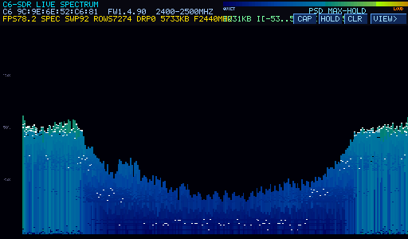
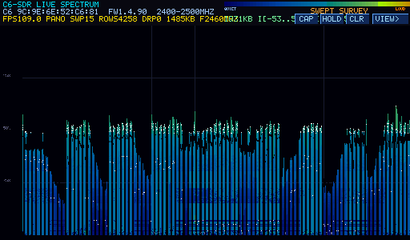
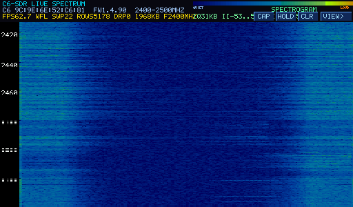
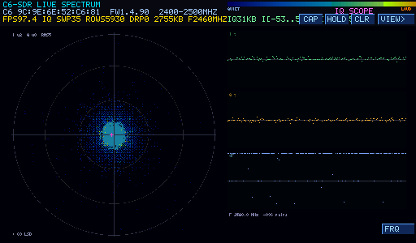

# c6_sdr — ESP32-P4 spectrum / raw-IQ front-end over the C6

Software-defined-radio pair for the ESP32-P4 Function EV board:

- `c6_firmware/` — hybrid ESP32-C6 slave firmware: ESP-Hosted-MCU
  (hosted v1.4.90, SDIO transport, RPC + OTA intact) **plus** the
  [ESP-SDR](https://github.com/codelabs-ch/esp-sdr) RF-capture engine.
  The C6 keeps answering hosted RPCs while also exposing SDR commands —
  so the P4 can call it like a "scan" API and the C6 can still be
  updated over the air (no ESP-Prog needed once this firmware is on).
- `src/` — Zephyr app on the P4: drives the SDR RPCs over the existing
  SDIO link, renders live on the 1024×600 DSI panel, and can dump
  results + screenshots to SD.

Everything flows through the SDIO hosted link already wired between the
P4 and the C6 — no extra cabling.

## Display views

The 1024×600 panel runs four full-screen chart pages. Cycle them with
the on-screen **`VIEW>`** button or the physical **BOOT** button
(`sw0`). The active page title and a 3-letter tag stay in the HUD.

### SPEC — PSD max-hold trace



A 256-point log-power FFT bar trace of the currently-tuned 80 MHz
block, accumulated as max-hold (bars rise and stay). The white overlay
is the live trace of the newest frame; the bars behind it are the
max-hold envelope. Left gutter shows quarter-scale level tags.
The dip in the middle is the LO/DC notch at the tuned frequency —
occupied Wi-Fi energy is visible climbing toward the block edges.

### PANO — swept survey



Max-hold panorama stitched across the whole 2360–2540 MHz sweep band —
each pixel column maps a fixed RF frequency, so the picture builds up a
station survey of the 2.4 GHz ISM band. Vertical gridlines + MHz labels
mark each 20 MHz sweep step. Fades slowly (decay) so dead channels
clear. This is the "which channels are busy" page.

### WFL — spectrogram (waterfall)



Time × frequency heat map: every incoming FFT frame paints one pixel
row and history scrolls upward continuously. Horizontal streaks are
persistent carriers (beacons, data channels); vertical smears are
wideband bursts. MHz labels in the left gutter scroll with their block
— the label sits on the tuned freq of the row it was captured at.

### IQ — constellation scope



Live iq8 bursts (~16 k pairs at ~3 ms/read) rendered as a phosphor
persistence scope: a 512×512 density map accumulates each burst and
decays ⅛ per frame, colored through the same dB heat ramp — signal
structure persists like a CRT. A dim cyan polyline overlays the latest
burst's sample trajectory (rotation direction = above/below LO).
Auto-scaled to a smoothed peak (`±N LSB` tag bottom-left), DC-centred
on the measured mean — the small magenta cross marks the DC offset
(LO leakage). Right column: `I(t)`, `Q(t)` oscilloscope strips and the
`dF` instantaneous-frequency trace (diff-phase = live FM demod).
Stats line shows `I µ / Q µ / RMS` (cloud ring-vs-blob metric), current
freq, pair count. **`FRQ`** button parks the scope on one frequency —
set a marker on PANO/SPEC first and it locks there; otherwise it uses
the current sweep step. The donut-shaped cloud in the capture is a
noise-dominated channel; a hard carrier draws a thin rotating ring.

## Controls

| Control | Where | Action |
|---|---|---|
| `VIEW>` | HUD button / BOOT button | cycle SPEC → PANO → WFL → IQ |
| `HOLD` | HUD button | freeze chart updates (stream keeps running) |
| `CLR` | HUD button | wipe max-hold / panorama / phosphor + marker |
| `FRQ` | IQ page only | lock bursts to marker freq (or current step) |
| `CAP` | HUD button | screenshot: `scr_<view>.bmp` on SD + RGB565 dump on UART |
| tap | chart area (not IQ) | magenta marker + `X.XM` freq readout |
| `c` / `v` | console UART | capture screen / cycle view (scriptable) |

The HUD shows MAC + firmware version (`1.4.90` = c6_sdr hybrid), FPS,
sweep counter, row/drop counts, staged KB, current freq, `*FAIL*`
flag and `RCV` (link-recovery count) tags, plus a dB colorbar.

## Architecture

```
 C6                          P4 (Zephyr)
 ┌──────────────────┐  SDIO  ┌────────────────────────────┐
 │ SDR engine       │ frames │ sdr.cpp: SPEC/IQ RPC pulls │
 │ 80 MS/s capture  │───────▶│ main.cpp: sweep loop       │
 │ (IRQs masked)    │  RPC   │   │ rows → disp_q msgq       │
 │ ring sink 96 KiB │◀───────│   ▼                        │
 │ FFT → SPC1       │        │ disp_thread: paint → fb    │
 │ iq8 bursts       │        │ scope_thread: IQ page      │
 │ protocomm/RPC    │        │ DSI zero-copy scanout 56Hz │
 └──────────────────┘        └────────────────────────────┘
```

- **Async SPEC runs** — `SdrSpec` kicks a C6-side run task and returns
  immediately; the P4 drains the ring with `SdrIqRead(offset)` chunks
  while capture continues (absolute-offset reads, `EAGAIN`=alive,
  `ENOENT`=drained, resync on overrun).
- **Display decoupling** — `sdr_row_cb` only enqueues a `disp_row`;
  `disp_thread` does all painting so transport pacing never blocks on
  cache flushes. The DSI framebuffer is scanned out zero-copy by the
  GDMA — painting is a PSRAM write + cache writeback.
- **Link watchdog** — three consecutive RPC failures (`rpc tx -116`,
  e.g. after a C6 reboot) trigger `esp_ng_slave_reinit()`: EN pulse,
  re-enumerate, verify MAC, resume the sweep. `RCV` tag in HUD counts
  recoveries.
- **Reset forensics** — the C6 logs `esp_reset_reason()` at boot so a
  mid-run reboot identifies itself (watchdog vs panic vs brownout).

## Host RPC API (ids 380–383)

Declared in `zephyr-esp32p4-v1-bsp/drivers/wifi/esp_hosted_ng/esp_hosted_ng.h`:

```c
int esp_ng_sdr_spec(const struct esp_ng_sdr_spec_req *, struct esp_ng_sdr_run_res *);
int esp_ng_sdr_iq_start(const struct esp_ng_sdr_iq_req *, struct esp_ng_sdr_run_res *);
int esp_ng_sdr_iq_read(uint32_t offset, uint8_t *buf, uint32_t buf_len,
                       uint32_t *got, uint32_t *total);
int esp_ng_sdr_stop(void);
```

- SPEC run emits `SPC1` frames: 28-byte header + `nfft` 8-bit
  log-power bins + CRC32 (`sdr_walk_spc1` in `src/sdr.cpp`).
- `SdrIqStart` mode 0 = single-shot burst (`n_words` = 256..16380
  pairs); mode 1 = ring run.
- `gain`: 255 = hardware AGC, 256 = keep, else manual code 0–54.
  `dcap`: 254 = PHY auto, 255 = keep, else filter code 0–63.
- RPC pacing ≈3 ms per read at ~1400 B/chunk — effective stream rate
  ~100–145 KB/s per sweep step.

## Screen capture / SD

- `CAP` button or `c` on the console dumps:
  - `/SD:/scr_<view>.bmp` — full-res 1024×600 24-bit BMP, and
  - a `@@SCR`-framed RGB565 half-res image on the UART (crc16-checked;
    `tools/` reassembles it into PNG — the images above came out this
    way).
- SD writes self-heal: a mounted-but-unwritable card is reformatted
  (`fs_mkfs` FAT) once, then SD output disables after repeated
  failures. `CONFIG_C6_SDR_SD_DUMP` also streams raw `c6_sdr_spec.bin` /
  `c6_sdr_iq.bin` captures to the card.

## Build / flash

```bash
# 1. C6 hybrid firmware (ESP-IDF 5.4)
cd c6_firmware && idf.py build
# OTA it if the C6 still runs hosted firmware:
#   C6_FW_FILE=c6_firmware/build/network_adapter.bin ../c6_ota/build.sh
#   ../c6_ota/flash.sh /dev/ttyUSB2

# 2. P4 app
./build.sh
./flash.sh /dev/ttyUSB2     # P4 console port
```

`network_adapter.bin` (~870 KiB) fits the C6's 1536 KiB OTA slot — the
whole cycle is reachable without opening the case.

## Recovery / restoring the C6

- **From hosted firmware:** plain OTA through `projects/c6_ota`.
- **From a dead/non-hosted image:** `c6_ota` recovery mode drives C6
  BOOT (P4 GPIO47) and EN (GPIO54) into ROM download, then flash over
  the PROG_C6 UART with esptool.
- The hybrid still implements `OTABegin/Write/End`, so you can OTA back
  to a stock hosted image any time.
- Runtime link wedges self-recover via the watchdog — the console shows
  `link: recovered after C6 reset` and the HUD shows `RCV`.

## Caveats

- The SDR capture path uses undocumented PHY/RF-register behavior from
  ESP-SDR — **hardware validation is required** before trusting
  absolute levels; bins are log-power codes (`db_step` in the header),
  not calibrated dBm.
- During a capture the C6 masks interrupts (bank-switch deadlines are
  ~180 µs), so hosted RPC traffic stalls for the run duration — the
  async SPEC design drains in the gaps between runs. ~100–115 rows/s is
  the honest ceiling at the ~3 ms RPC round-trip.
- Continuous FM audio is not feasible: the C6 has no decimated-IQ path
  (S3-only) and ~250 kS/s IQ would need ~5× the link throughput — the
  IQ page + demod blip is the honest version of that demo.
- 100–6000 MHz tuning range; the useful instantaneous view is the
  ~40 MHz analog front-end bandwidth around the tuned frequency.
